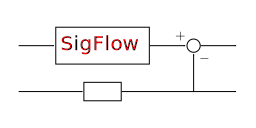

|logo|

*Construct real-time control systems using SigFlow*

|website| |release| |rtd| |license| |travis-ci| |codecov|

SigFlow
=======

SigFlow is a python package allows you design and run custom control
topology in real-time with actual hardware.
It provides classes for control block diagram elements, such as filters,
junctions, and matrices.
These elements can be inter-connected to form a custom control systems
and it can be run at real-time if hardware interfaces is provided.

**features**

* Design control systems with custom  topology by making custom block-dragrams.
* Runs control systems in real-time with hardware interfaces.

**Documentation**: https://sigflow.readthedocs.io

**Repository**: https://github.com/terrencetec/sigflow

.. contents::
   :depth: 2

Getting Started
===============

Dependencies
------------

Required
^^^^^^^^
* Package 1
* Package 2
* Package 3

Optional
^^^^^^^^
* Package 4

Note on installing dependencies
^^^^^^^^^^^^^^^^^^^^^^^^^^^^^^^
In principle, if you are using :code:`pip`, you don't have to install
dependencies beforehand. When you install this package, :code`pip` will
automatically install the required libraries. However if you are using Conda
it is best to use its own package manager and not pip unless absolutely
necessary.

If you use conda:

.. code:: bash

   conda install -c conda-forge package1 package2

Now, let's say package 3 is not available, then we can use pip. But,
be sure to use :code:`which pip` to check if we are using the pip installed
on the conda environment and not the global one.

.. code:: bash

   pip install package3

Install from source
-------------------

.. code:: bash

   git clone https://github.com/terrencetec/sigflow.git
   cd sigflow
   pip install .

How to Contribute
=================

Try out the package and file an issue if you find any!

For Developers
==============

Standards and Tools
-------------------
Please comply with the following standards/guides as much as possible.

Coding style
^^^^^^^^^^^^
- **PEP 8**: https://www.python.org/dev/peps/pep-0008/

CHANGELOG
^^^^^^^^^
- **Keep a Changelog**: https://keepachangelog.com/en/1.0.0/

Versioning
^^^^^^^^^^
- **Semantic Versioning**: https://semver.org/spec/v2.0.0.html

Packaging
^^^^^^^^^
- **PyPA**: https://www.pypa.io
- **python-packaging**: https://python-packaging.readthedocs.io

Documentation
^^^^^^^^^^^^^
- **NumPy docstrings**: https://numpydoc.readthedocs.io/en/latest/format.html
- **Sphinx**: https://www.sphinx-doc.org/
- **Read The Docs**: https://readthedocs.org/
- **Documenting Python Code: A Complete Guide**: https://realpython.com/documenting-python-code/

Cheat sheet
-----------

Sphinx
^^^^^^

Generate documentation base, in docs/,

.. code:: bash

   sphinx-quickstart

Select separate build and source files when prompted.

Preview documentation page with modified source, in docs/

.. code:: bash

   make html

Open index.html with a browser (if this was set as the first page).

.. |website| image:: https://img.shields.io/badge/website-sigflow-blue.svg
    :alt: Website
    :target: https://github.com/terrencetec/sigflow

.. |release| image:: https://img.shields.io/github/v/release/terrencetec/sigflow?include_prereleases
   :alt: Release
   :target: https://github.com/terrencetec/sigflow/releases

.. |rtd| image:: https://readthedocs.org/projects/sigflow/badge/?version=latest
   :alt: Read the Docs
   :target: https://sigflow.readthedocs.io/

.. |license| image:: https://img.shields.io/github/license/terrencetec/sigflow
    :alt: License
    :target: https://github.com/terrencetec/sigflow/blob/master/LICENSE

.. |travis-ci| image:: https://travis-ci.com/terrencetec/sigflow.svg?branch=master
    :alt: travis-ci
    :target: https://travis-ci.com/terrencetec/sigflow

.. |codecov| image:: https://codecov.io/gh/terrencetec/sigflow/branch/master/graph/badge.svg?token=NMEBAYFE2N
    :alt: codecov
    :target: https://codecov.io/gh/terrencetec/sigflow
